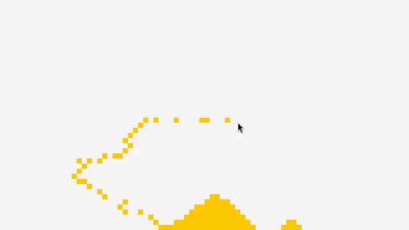

# Sandspiel Go

Welcome to the Sandspiel Go project! This project is a simple simulation of sand falling, inspired by the classic Sandspiel game. It is built using the Go programming language and utilizes the Raylib library for graphics.

inspiered by: 
[https://sandspiel.club]
[https://codingtrain.github.io/website-archive/CodingChallenges/107-sandpiles.html]




## Table of Contents

- [Features](#features)
- [Installation](#installation)
- [Usage](#usage)
- [How It Works](#how-it-works)
- [Contributing](#contributing)
- [License](#license)

## Features

- Interactive sand simulation
- Simple and intuitive controls
- Real-time rendering using Raylib

## Installation

To get started with the Sandspiel Go project, follow these steps:

1. **Clone the repository:**
   
   ```bash
   git clone https://github.com/Simon-Po/Sandspiel_go.git
   cd Sandspiel_go
   ```

2. **Install Go (if not already installed):**
   Follow the instructions on the [official Go website](https://golang.org/doc/install).

3. **Install dependencies:**
   ```bash
   go mod tidy
   ```

## Usage

To run the simulation, use the following command:

```bash
make
```

This will execute the `Makefile` and run the Go program.

### Controls

- **Left Mouse Button:** Click to drop sand particles.

## How It Works

The simulation is based on a grid where each cell can either be empty or filled with sand. The sand particles fall downwards, and if they encounter another particle, they can move diagonally to the left or right, simulating the behavior of sand.

### Key Components

- **Window Initialization:** The window is created using Raylib with a specified width and height.
- **Sand Map:** A 2D slice of booleans represents the grid of sand particles.
- **Drawing Loop:** The main loop handles user input, updates the sand map, and renders the current state to the screen.
- **Next Generation Calculation:** The `generate_next_gen` function computes the next state of the sand map based on the current state.

## Contributing

Contributions are welcome! If you have suggestions for improvements or new features, feel free to open an issue or submit a pull request.

## License

This project is licensed under the MIT License. See the [LICENSE](LICENSE) file for details.

---

Enjoy simulating sand with Sandspiel Go!
